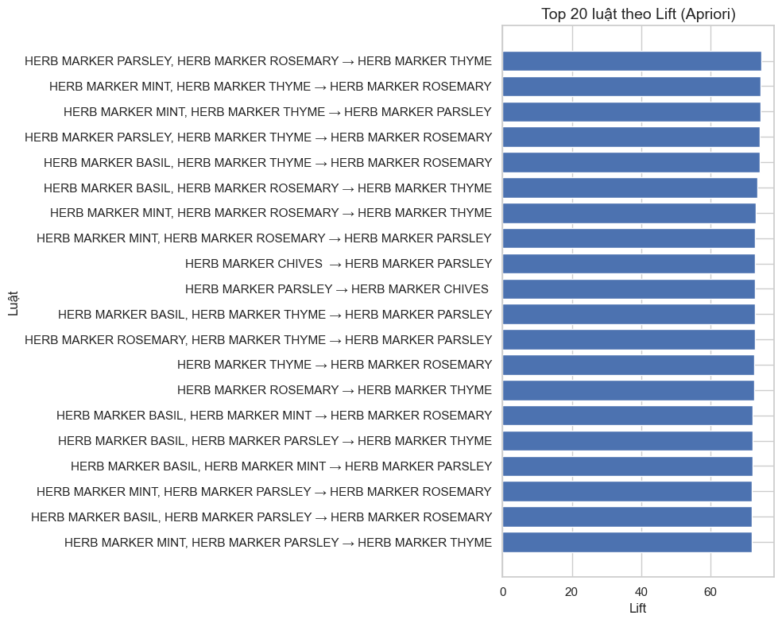

# 📦 Case Study: Phân tích giỏ hàng với Apriori

## 👥 Thông tin Nhóm
- **Nhóm:** 
- **Thành viên:** 
  - 1671040025 Nguyễn Trung Thành
  - 1771040010 Nguyễn Văn Hải
  - 1771040011 Bế Quang Hải
- **Chủ đề:** 3
- **Dataset:** Online Retail (UCI)

## Mục tiêu 
Mục tiêu
Ưu tiên các luật có mối quan hệ thực sự khác ngẫu nhiên
Loại bỏ các luật “trông có vẻ tốt” nhưng thực chất chỉ phản ánh độ phổ biến

## 1. Ý tưởng & Feynman Style
Giải thích lại bài toán theo cách **dễ hiểu nhất** (không technical):
- Apriori giúp chúng ta tìm ra những sản phẩm thường được mua cùng nhau trong một cửa hàng.
- Vì dữ liệu giỏ hàng rất đơn giản nhưng rất nhiều:
  - Mỗi hóa đơn chỉ là một danh sách sản phẩm
  - Nhưng số lượng hóa đơn thì lớn
- Ý tưởng thuật toán
  - Nếu một nhóm sản phẩm ít khi xuất hiện, thì mọi nhóm lớn hơn chứa nó cũng sẽ ít xuất hiện.

## 2. Quy trình Thực hiện

1) Load & làm sạch dữ liệu  
2) Tạo ma trận basket  
3) Áp dụng Apriori  
4) Trích xuất luật  
5) Trực quan hóa  
6) Phân tích insight  

## 3. Tiền xử lý Dữ liệu
- Những bước làm sạch:
  - Loại bỏ sản phẩm "rỗng"
  - Loại bỏ transaction bị cancel (InvoiceNo bắt đầu "C")
  - Loại bỏ số lượng âm

- Thống kê nhanh:
  - Số giao dịch sau lọc: 485,123 giao dịch
  - Số sản phẩm duy nhất: 541,909 giao dịch

## 4. Áp dụng Apriori
**Tham số sử dụng:**
- `min_support = 0.01`
- `min_threshold = 1.0`
- `max_len = 3`

```python
from mlxtend.frequent_patterns import apriori, association_rules

frequent_itemsets = apriori(basket_df, min_support=0.002, use_colnames=True)
rules = association_rules(frequent_itemsets, metric="lift", min_threshold=1)
rules.sort_values("lift", ascending=False, inplace=True)
rules.head()
```

## 5. Trực quan hóa (Visualization)

- Hình 1: caption mô tả…
- Hình 2: caption mô tả…


## 6. Insight từ Kết quả
**Insight #1:**  
**Insight #2:**  
**Insight #3:**  
**Insight #4:**  
**Insight #5:**  

## 7. Kết luận & Đề xuất Kinh doanh
- Gợi ý cross-sell…
- Gợi ý sắp xếp hàng trên kệ…
- Gợi ý khuyến mãi theo mùa…


## 8. Link Code & Notebook
- Notebook:
- Repo:

## 9. Slide trình bày
- Link Slide: